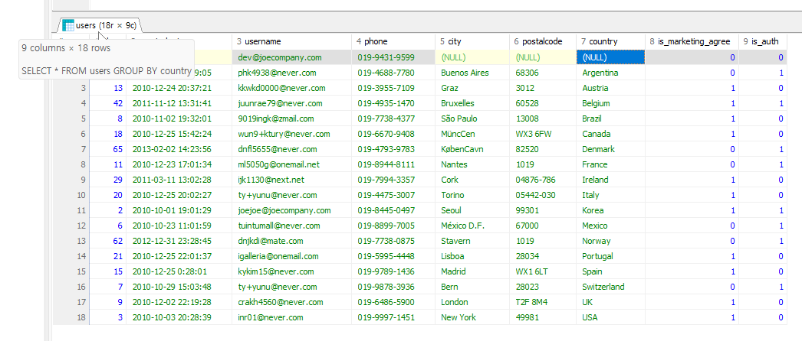
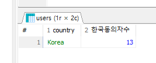
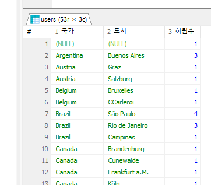

## GROUP BY
- 어떤 기준으로 묶어서 _계산_ 할 것인가 ?
예를 들어
```sql
SELECT * FROM users GROUP BY country;
```

라고 나옵니다.
원래 `SELECT * FROM users;` 를 호출했을 경우 row 개수가 77개 였는데 지금 보면 18개로 줄어있죠. 여기서의 의미는 country 의 row 값들 중 중복은 전부 안 나오고 가장 위에 있는 row 하나만 나오기 때문에 저희 데이터 기준 null 포함 18개 국가 종류, null 제외 17개만 나옵니다. COUNT(country) 를 한 결과와 같습니다(이전 수업 확인).

- 집계 함수를 활용하여 특정 컬럼의 row 값들을 계산해봤습니다. 함수로 평균을 계산하거나 전체 합을 구해봤습니다.
- 하지만 집계 함수만으로는 원하는 결과를 얻을 수 없을 때가 있습니다. 예를 들어 전체 회원 수가 아니라 국가별 회원 수를 구하거나, 월별 회원수를 구할 때 등이겠죠.

- 문제 예시 : users 에서 국가별 회원 수를 추출하기
```sql
SELECT country, COUNT(DISTINCT id) AS 국가별사용자수 FROM users GROUP BY country;
```
- GROUP BY 를 이용하여 국가별 회원 수를 추출했습니다. GROUP BY 는 **집계 함수와 함께 사용**되며 GROUP BY 기준 컬럼은 SELECT 에서 집계 함수를 사용할 때 묶어서 계산을 수행하는 기준이 됩니다.
- GROUP BY 를 이용할 경우 데이터를 분류하고 계산하면서 데이터의 특성을 더 잘 파악할 수 있습니다.

- 응용 문제 : users 에서 거주 국가가 Korea 인 회원 중 마케팅 수신에 동의한 회원 수를 구하시오. 컬럼명 '한국동의자수'
```sql
SELECT COUNT(DISTINCT id) AS 한국동의자수 FROM users WHERE country = 'Korea' AND is_marketing_agree = 1;
```

이상의 경우 결국 한국의 마케팅 수신 동의자 수만 출력할 수 있습니다. 예를 들어 USA 를 추가하고 싶다고 가정해보겠습니다.
**안되는 예시**
```sql
SELECT country, COUNT(DISTINCT id) AS 한국동의자수 FROM users WHERE country IN ('Korea', 'USA') AND is_marketing_agree = 1;
```
그래서 이상과 같이 작성할 경우

와 같이 한국 및 미국의 전체 마케팅 동의한 애들만 튀어나온다는 단점이 있습니다. 총합만 구할 수 있다는 의미가 되겠네요.

결국 WHERE 절만 가지고는 국가별로 마케팅 수신 동의 여부를 쿼리문 하나씩 써가지고 직접 엑셀로 입력하고 거기서 합 함수를 다시 써야할지도 모르겠습니다.

- 하지만 GRUOP BY 를 사용하게 되면 '국가별 회원수' 및 '동의자수'의 교집합을 충족하는 쿼리를 작성할 수 있습니다.

- users 에서 거주 국가 별로 마케팅 수신 동의한 회원 및 동의하지 않은 회원 수를 구할겁니다.
```sql
SELECT country, is_marketing_agree, COUNT(DISTINCT id) AS 회원수 FROM users GROUP BY country, is_marketing_agree ORDER BY country, 회원수 DESC;
```

```sql
SELECT country AS 국가, is_marketing_agree AS 마케팅수신동의, COUNT(DISTINCT id) AS 회원수 FROM users GROUP BY 국가, 마케팅수신동의 ORDER BY country, 회원수 DESC;
```
그리고 이상과 같이 작성했을 때도 SQL 문이 이상없이 실행되는 것을 확인해봤을 때 GROUP BY 와 SELECT 중에서 SELECT 가 먼저 실행되는 것을 알 수 있습니다(ORDER BY 도 SELECT 보다 늦게 실행됐습니다).

- ORDER BY 는 맨마지막입니다. 그래서 지금 추론할 수 있는 것은
  1. FROM - 테이블 선택해야 하니까
  2. SELECT - 테이블 내에서 컬럼 선택해야하니까(컬럼명 편집 가능)
  3. GROUP BY - 편집된 컬럼명으로 분류가 가능하다는 점에서 _추론 가능_
  4. ORDER BY - 최종 결과를 기준으로 오름/내림 차순을 적용하기 때문에.

- 그런데 의문을 제기한다면 그 이유가 시험에서 어떻게 나왔느냐입니다. 그러면 시험 기준으로 하시면 됩니다.
- DBMS 마다 편집된 컬럼을 허용하지 않는 경우가 있기 때문입니다.

- 마찬가지로 ORDER BY 처럼 GROUP BY 도 작성된 순서를 기준으로 합니다. 즉, 이상의 쿼리문에서는 country 를 기준으로 먼저 그룹화를 하고, 그 다음 is_marketing_agree 를 기준으로 그룹화하게 됩니다.

- 응용 문제 : users 에서 국가 내 도시별 회원수를 추출하시오(국가명은 알파벳순으로 정렬하고, 국가 내에서는 회원 수 기준 내림차순 정렬하고, 컬럼명을 한국어로 다 바꾸시오).
```sql
SELECT country AS 국가, city AS 도시, COUNT(DISTINCT id) AS 회원수 FROM users GROUP BY country, city ORDER BY 국가, 회원수 DESC, city;
```
분석 시에 지표를 그룹으로 묶는 기준을 차원(dimesion) 이라고 하고, 각 차원에 대해 계산을 수행할 때 적용하는 계산식을 메트릭(metric) 이라고 합니다.


이상의 이미지에서 국가 / 도시는 차원이고, 회원수는 메트릭입니다.

- 응용 문제 : users 에서 월별(2013-01) 가입 회원 수를 출력하시오(created_at 컬럼을 활용하고, 최신 순으로 정렬합니다).
```sql
SELECT SUBSTR(created_at,1,7) AS 월별, COUNT(DISTINCT id) AS 회원수 FROM users GROUP BY SUBSTR(created_at,1,7) ORDER BY 월별 DESC;
```
이상에서 중요한 것은 SUBSTR() 함수가 컬럼에 적용되는 집계 함수가 아니라 row 에 적용되는 일반 함수라는 점입니다. 그러니까 GROUP BY 에서 created_at 을 잘라낸 애를 기준으로 그룹화하는 것이 가능하다는 점이 포인트입니다.

## GROUP BY 전체 정리
- 그룹별로 수치를 계산할 때 사용.
- 콤마를 기준으로 두 개 이상 지정 가능. 이 때, 명시된 컬럼 순서에 따라 그룹의 층위가 결정되므로 순서를 명확하게 설계할 필요가 있음.
1. 
```sql
GROUP BY col1, col2, ... 두 개 이상의 기준 지정
```
  - GROUP BY 지정시에는 적은 컬럼을 SELECT 문에도 동일한 순서로 작성하여 계산된 수치의 기준을 알려주면 좋습니다. 예를 들어 이상에서처럼 국가 내 도시별 회원 수를 구했는데 회원수 컬럼만 출력한다면 어느 국가, 어느 도시의 회원 수인지 알 수 없으므로,
```sql
SELECT col1, col2, ...
  ...
  GROUP BY col1, col2
```
2. GROUP BY 에 작성한 기준 컬럼은 DISTINCT 를 사용한 것처럼 **중복없이** 표시됩니다. 컬럼 값이 동일한 데이터는 같은 그룹으로 묶여 중복 제거가 일어납니다. 또한 GROUP BY 에 작성한 기준 컬럼 외에는 중복 제거된 row 들만 남게 되므로 추가적인 부분은 집계 함수를 사용하여 그룹별 연산을 따로 수행해줘야 합니다.
```sql
SELECT col1, col2, count(*), sum(col3)...
  ...
  GROUP BY col1, col2
```

## 연습 문제
1. 주문 상세 정보 테이블에서 주문 아이디별 주문 수량의 총합을 출력하시오.(주문 수량의 총합이 내림차순일 것 - 컬럼명 통제 안 하겠습니다. 적당히 한국어로 쓸 것, 시험과 관련 있도록 작성할 것)
```sql
SELECT order_id AS 주문자, SUM(quantity) AS 합계 FROM orderdetails GROUP BY 주문자 ORDER BY 합계 DESC;
```

2. 주문 정보 테이블에서 직원 아이디별, 회원 아이디별로 주문 건수를 출력하시오.(단, 직원 아이디 기준 오름차순으로 먼저 정렬한 뒤에 주문 건수 내림차순 정렬할 것)
```sql
SELECT staff_id AS 직원, user_id AS 회원, COUNT(DISTINCT order_date) AS 주문건수 FROM orders GROUP BY staff_id, user_id ORDER BY staff_id, 주문건수 DESC;
```

3. 주문 정보 테이블에서 _월별_ 로 주문한 회원 수를 출력하시오(최신순 정렬)
```sql
SELECT SUBSTR(order_date,1,7) AS 월별, COUNT(DISTINCT user_id) AS 회원수 FROM orders GROUP BY 월별 ORDER BY 월별 DESC;
```

## HAVING
- 집계 값은 어떻게 필터링 하는가 ?
  - 예를 들어 회원 수가 n 명 이상인 국가의 회원 수만 보고 싶다면 어떻게 해야하는가? 와 같은 질문에 답변할 수 있습니다.
  - 현재 상황에서 WHERE 은 SELECT 이전에 실행되기 때문에 집계함수가 적용 전이라서 COUNT() 함수의 적용 후 결과값을 WHERE 절에 반영할 수 없다는 문제점이 있겠네요.
  -GROUP BY 로 그룹화하고 집계한 데이터를 필터링 할 때 WHERE 을 쓰기 어려운 이유를 알아보고, HAVING 로직을 학습하겠습니다.

- 예시 문제 : users 에서 country 가 한국, 미국, 프랑스인 회원 수를 국가별로 계산하는 쿼리문을 작성하시오.
```sql
SELECT country, COUNT(DISTINCT id) AS 국가별회원수 FROM users WHERE country IN ('Korea', 'USA', 'France') GROUP BY country; 
```
그래서 특정 국가의 회원수는 WHERE 을 통해 추출이 가능합니다. 얘는 집계 함수의 결과값이 아니라 국가별 필터링이 먼저 적용됐기 때문입니다. 하지만 3개 국의 회원수 말고 전체 국가를 기준으로 8명 이상인 국가의 회원 수만 추출하기 위해서는 집계 함수의 실행이 선행되어야 합니다.
```sql
WHERE COUNT(DISTINCT id) >= 8
```
와 같이 작성하려고 하면 결과적으로 집계 함수를 SELECT 절이 아닌 다른 부분에 작성했기 때문에 오류가 발생할겁니다.

-> 그래서 HAVING 씁니다.
```sql
SELECT country, COUNT(DISTINCT id) AS 국가별회원수 FROM users GROUP BY country HAVING COUNT(DISTINCT id) > 7 ORDER BY 국가별회원수 DESC; 
```

- 문제 : orders 에서 담당 직원별 주문 건수와 주문 회원 수를 계산하고, 주문 건수가 10건 이상이면서 주문 회원 수가 40명 이하인 데이터만 출력하시오(단, 주문 건수 기준으로 내림차순 정렬할 것)
```sql
SELECT staff_id, COUNT(DISTINCT id) AS 회원수, COUNT(DISTINCT user_id) AS 주문수 FROM orders GROUP BY staff_id HAVING 회원수 >= 10 AND 주문수 <= 40 ORDER BY 회원수 DESC;
```

- 연습 문제
  1. orders 테이블에서 회원별 주문건수를 추출하시오(주문건수가 7건 이상인 회원인 정보만 추출하고, 주문 건수 기준으로 내림차순 정렬할 것. user_id / id 컬럼 활용)
```sql
SELECT user_id AS 회원수, COUNT(DISTINCT id) AS 주문건수 FROM orders GROUP BY 회원수 HAVING 주문건수 >= 7 ORDER BY 주문건수 DESC;
```

  2. users 에서 국가별 도시 수와 국가별 회원 수를 추출하시오(단, 도시 수가 5개 이상이고 회원 수가 3명 이상인 정보만 추출하고 도시수, 회원수 기준으로 모두 내림차순 정렬할 것)
```sql
SELECT country AS 국가, COUNT(DISTINCT city) AS 도시, COUNT(DISTINCT id) AS 회원수 FROM users GROUP BY 국가 HAVING 도시 >= 5 AND 회원수 >= 3 ORDER BY 도시 DESC, 회원수 DESC;
```

  3. users 에서 미국, 브라질, 한국, 아르헨티나, 멕시코에 거주중인 회원 수를 국가별로 추출하시오(단, 회원 수가 5명 이상인 국가만 추출하고 회원 수 기준 내림차순 정렬하시오)
```sql
SELECT country AS 국가, COUNT(DISTINCT id) AS 회원수 FROM users WHERE country IN ('Korea', 'USA', 'Brazil', 'Maxico', 'Argentina') GROUP BY 국가 HAVING 회원수 >= 5 ORDER BY 회원수 DESC;
```

## 시험용 SELECT 문 실행 순서
1. FROM(JOIN 포함) : 대상 테이블을 참조하고 JOIN 적용으로 합쳐진 데이터셋(테이블)을 구성.
2. WHERE : 행 단위를 필터링(집계함수사용불가)
3. GROUP BY : 데이터를 특정 컬럼 기준으로 그룹화
4. HAVING : 그룹화된 데이터에 조건을 걸어서 필터링
5. SELECT : 출력할 컬럼 선택하고 Alias 부여(컬럼명 편집 시점)
6. DISTINCT : 중복된 행을 제거
7. ORDER BY : 데이터를 정렬
8. LIMIT / TOP / OFFSET : 최종 결과 중 출력할 개수 제한
### 이상의 순서에서의 중요한 점
1. 별칭(Alias)의 제약 : `SELECT` 의 단계가 `WHERE`, `GROUP BY` 보다 늦게 실행되기 때문에 WHERE 절에서는 SELECT 에서 정의한 별칭을 사용할 수 없는 반면에 `ORDER BY` 는 별칭 사용이 가능합니다.
2. 성능 최적화 : 실행 순서를 기반으로 했을 때 쿼리 최적화를 쉽게 할 수 있습니다. 예를 들어 WHERE 절에서 데이터 개수를 줄여놓게 되면 이후 GROUP BY 나 ORDER BY 시에 부하가 줄어들 수 있겠네요.
3. 표준에서의 예외 : 요새 DBMS 는 사용자 편의를 위해 GROUP BY 에서 SELECT 를 허용하기는 하지만(그래서 실무에서는 쓰지만), 이론적으로는 SQL 에서 WHERE/GROUP BY 에서 별칭 사용이 불가능합니다.
  - 안 되는 대표적인 SQL server : Oracle / SQL server(MSSQL)
